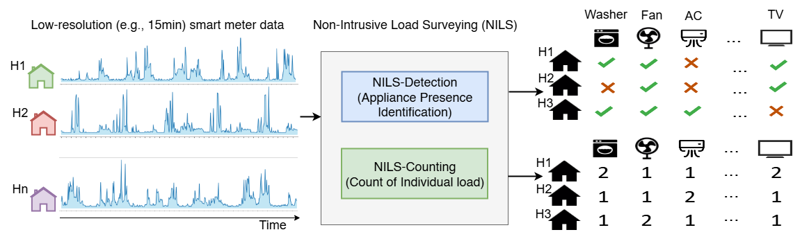

## Non-Intrusive Load Surveying (NILS)


We introduce the problem of **Non-Intrusive Load Surveying (NILS)**, which involves identifying and estimating the count of electrical appliances in buildings using only aggregate electricity consumption data from a single smart meter, without the need for intrusive monitoring or device-level instrumentation. Unlike Non-Intrusive Load Monitoring (NILM), which aims to disaggregate energy usage into appliance-level operational profiles, NILS focuses solely on detecting the presence of appliances, irrespective of their usage frequency or duration. This shift in focus makes NILS particularly relevant for applications such as energy auditing, targeted demand response, appliance stock estimation, and personalized energy feedback, where knowledge of appliance inventory is more critical than fine-grained usage patterns.

In this paper, we formally define the Non-Intrusive Load Surveying (NILS) problem and highlight its practical significance. We also present two key variants of the task: (a) **NILS-Detection**, which involves determining whether specific appliance types (e.g., washing machine, air conditioner) are present in a household; and (b) **NILS-Counting**, which aims to estimate the number of appliances of each type. To evaluate the feasibility of NILS, we conduct a comprehensive benchmarking study using four diverse datasets spanning over 5,600 buildings and more than 25 appliance types from both commercial and residential settings. We implement and compare several state-of-the-art time series classification and regression models for the NILS-Detection and NILS-Counting tasks. Our analysis also examines the impact of sampling intervals (15, 30, and 60 minutes) on model performance. The results demonstrate that NILS is both feasible and scalable, offering a promising direction for surveying household appliance usage using existing smart metering infrastructure. We also discuss key challenges, current limitations, and future research directions to advance the development and deployment of NILS.
This repository contains the reprodicble dataset, code and results.  


### Results

**Model performance comparison using macro F1 score across different datasets for multiple appliances at 15-minute resolution.**  
*Base refers to a dummy classifier that predicts the majority class. The best scores for each appliance are shown in bold, and the second-best scores are underlined.*

1. **Comstock** Results.

| **Load**   |    **Base** |    **KNNeucli** | **cBOSS** | **eBOSS** | **Arsenal** | **Rocket** |   **Minirocket** | **DrCIF** |    **TSForest** |  **Rise** |    **ConvNet** | **ResNet** |   **ResNetAtt** |
|:---------------|------:|------:|-----------:|-----------:|------:|------------:|-------:|-----------:|------:|-----------:|------:|------------:|-------:|
| **Cooling** | 0.4329 | 0.7298 | **0.8438** | 0.8085 | _0.8395_ | 0.8270 | 0.8166 | 0.8244 | 0.7942 | 0.7734 | 0.7365 | 0.7853 | 0.6621 |
| **Fans** | 0.4746 | 0.6757 | **0.8316** | 0.7119 | _0.8036_ | **0.8316** | 0.7477 | 0.7881 | 0.7184 | 0.6400 | 0.5272 | 0.7841 | 0.6334 |
| **Heat Rej.** | 0.4690 | 0.5773 | 0.4959 | 0.6036 | _0.6603_ | **0.6792** | 0.6191 | 0.5616 | 0.4895 | 0.5224 | 0.5095 | 0.4927 | 0.5631 |
| **Heating** | 0.3548 | 0.6959 | 0.7516 | 0.7689 | 0.8346 | **0.8730** | _0.8625_ | 0.8505 | 0.8415 | 0.7863 | 0.7416 | 0.7742 | 0.8433 |
| **Refrigeration** | 0.4059 | 0.7754 | 0.8189 | 0.8288 | **0.9343** | 0.9076 | 0.8746 | _0.9143_ | 0.8457 | 0.8070 | 0.7209 | 0.7898 | 0.7997 |
| **Water Sys.** | 0.4208 | 0.5792 | 0.8616 | 0.7453 | 0.8326 | 0.8428 | **0.9047** | _0.8690_ | 0.7222 | 0.7188 | 0.6993 | 0.7570 | 0.5953 |
| **Mean** | 0.4263 | 0.6722 | 0.7672 | 0.7445 | _0.8175_ | **0.8269** | 0.8042 | 0.8013 | 0.7353 | 0.7080 | 0.6558 | 0.7305 | 0.6828 |

2. **Restock** Results.

| **Load**   |    **Base** |    **KNNeucli** | **cBOSS** | **eBOSS** | **Arsenal** | **Rocket** |   **Minirocket** | **DrCIF** |    **TSForest** |  **Rise** |    **ConvNet** | **ResNet** |   **ResNetAtt** |
|:---------------|------:|------:|-----------:|-----------:|------:|------------:|-------:|-----------:|------:|-----------:|------:|------------:|-------:|
| **Ceiling fan** | 0.3988 | 0.5418 | 0.5600 | 0.5563 | _0.5842_ | **0.5850** | 0.5814 | 0.5754 | 0.5830 | 0.5626 | 0.5603 | 0.5560 | 0.5133 |
| **Clothes dryer** | 0.3988 | 0.6571 | 0.6078 | 0.6188 | 0.6963 | 0.7159 | **0.7626** | _0.7204_ | 0.7081 | 0.6910 | 0.6483 | 0.6511 | 0.6091 |
| **Clothes washer** | 0.4048 | 0.7035 | 0.6813 | 0.6739 | 0.7417 | 0.7407 | **0.7878** | _0.7704_ | 0.7555 | 0.7257 | 0.6732 | 0.6527 | 0.5796 |
| **Cooling** | 0.4297 | **0.5510** | 0.4586 | 0.5160 | 0.4813 | 0.5154 | 0.4923 | 0.4340 | 0.4424 | 0.4391 | 0.4275 | 0.4761 | _0.5203_ |
| **Cooling fans pumps** | 0.3617 | 0.5407 | 0.5009 | 0.5466 | _0.6157_ | 0.5965 | **0.6290** | 0.6034 | _0.6157_ | 0.5350 | 0.4795 | 0.5007 | 0.5532 |
| **Dishwasher** | 0.4012 | 0.6077 | 0.6453 | 0.6594 | 0.6455 | 0.6270 | 0.6851 | **0.7042** | 0.6901 | _0.7008_ | 0.6141 | 0.5805 | 0.5090 |
| **Freezer** | 0.4505 | **0.5112** | 0.4498 | 0.4565 | 0.4498 | 0.4599 | 0.4747 | 0.4502 | 0.4624 | 0.4502 | 0.4478 | 0.4745 | _0.5038_ |
| **Heating** | 0.4242 | 0.6538 | 0.6532 | 0.6333 | 0.8284 | **0.8412** | _0.8311_ | 0.8254 | 0.7483 | 0.6917 | 0.7782 | 0.7803 | 0.6807 |
| **Heating fans pumps** | 0.4208 | 0.5089 | 0.5617 | 0.5515 | _0.5921_ | **0.6288** | 0.5514 | 0.5557 | 0.5834 | 0.5332 | 0.5166 | 0.5200 | 0.5051 |
| **Hot water** | 0.4455 | 0.4587 | 0.7938 | 0.9416 | 0.9699 | 0.9735 | 0.9730 | **0.9820** | 0.8914 | 0.9063 | 0.9631 | _0.9752_ | 0.7353 |
| **Lighting garage** | 0.4175 | 0.5497 | 0.4461 | 0.4693 | 0.5821 | _0.5988_ | **0.6258** | 0.5334 | 0.5490 | 0.4691 | 0.5392 | 0.5618 | 0.5080 |
| **Mean** | 0.4140 | 0.5713 | 0.5780 | 0.6021 | 0.6534 | _0.6621_ | **0.6722** | 0.6504 | 0.6390 | 0.6095 | 0.6043 | 0.6117 | 0.5652 |

3. **CER Dataset** Results.

| **Load**   |    **Base** |    **KNNeucli** | **cBOSS** | **eBOSS** | **Arsenal** | **Rocket** |   **Minirocket** | **DrCIF** |    **TSForest** |  **Rise** |    **ConvNet** | **ResNet** |   **ResNetAtt** |
|:---------------|------:|------:|-----------:|-----------:|------:|------------:|-------:|-----------:|------:|-----------:|------:|------------:|-------:|
| **Cooker** | 0.4314 | 0.4836 | 0.4311 | 0.4374 | 0.5414 | 0.5636 | 0.5674 | 0.5283 | 0.5489 | 0.4425 | **0.5902** | _0.5835_ | 0.5309 |
| **Desktop** | 0.3449 | 0.5252 | 0.5335 | 0.5582 | 0.5833 | 0.5732 | 0.6276 | _0.6489_ | 0.6347 | **0.6518** | 0.5601 | 0.6043 | 0.5225 |
| **Dishwasher** | 0.3984 | 0.5463 | 0.4137 | 0.4645 | 0.6161 | 0.6250 | **0.6973** | _0.6595_ | 0.6485 | 0.6319 | 0.5804 | 0.6417 | 0.5629 |
| **Pluginheater** | 0.4073 | _0.4900_ | 0.4218 | 0.4134 | 0.4635 | 0.4806 | 0.4645 | 0.4066 | 0.4113 | 0.4095 | 0.4210 | 0.4127 | **0.5009** |
| **Tumbledryer** | 0.4056 | 0.5303 | 0.4078 | 0.4525 | 0.5478 | 0.5775 | 0.6237 | **0.6281** | _0.6262_ | 0.6042 | 0.5656 | 0.5881 | 0.5058 |
| **Washing** | 0.4959 | **0.5175** | 0.4959 | 0.4959 | 0.4957 | 0.4957 | 0.4959 | 0.4959 | 0.4957 | 0.4957 | _0.4973_ | 0.4364 | 0.4718 |
| **Waterheater** | 0.3588 | 0.4831 | 0.4401 | 0.5180 | 0.5665 | 0.5578 | _0.6243_ | **0.6409** | 0.6151 | 0.6068 | 0.5903 | 0.6102 | 0.5325 |
| **Mean** | 0.4060 | 0.5109 | 0.4491 | 0.4771 | 0.5449 | 0.5533 | **0.5858** | _0.5726_ | 0.5686 | 0.5489 | 0.5436 | 0.5538 | 0.5182 |


4. **CER Dataset** Results

| **Load**   |    **Base** |    **KNNeucli** | **cBOSS** | **eBOSS** | **Arsenal** | **Rocket** |   **Minirocket** | **DrCIF** |    **TSForest** |  **Rise** |    **ConvNet** | **ResNet** |   **ResNetAtt** |
|:---------------|------:|------:|-----------:|-----------:|------:|------------:|-------:|-----------:|------:|-----------:|------:|------------:|-------:|
| **Air conditioners** | 0.4474 | 0.5459 | 0.4474 | 0.4474 | 0.4474 | 0.4474 | **0.7429** | 0.6815 | 0.6912 | _0.7159_ | 0.4474 | 0.2513 | 0.4815 |
| **Air coolers** | 0.4167 | 0.4094 | 0.4857 | 0.5206 | 0.4857 | 0.5536 | **0.7172** | 0.6681 | _0.6939_ | 0.5944 | 0.4167 | 0.6298 | 0.5159 |
| **Fridge** | 0.4615 | **0.5855** | _0.4615_ | 0.4474 | _0.4615_ | _0.4615_ | _0.4615_ | _0.4615_ | _0.4615_ | _0.4615_ | 0.3753 | _0.4615_ | 0.4247 |
| **Inverter** | 0.4000 | 0.4296 | 0.4000 | 0.4997 | 0.4596 | 0.5206 | **0.7375** | _0.6062_ | 0.5873 | 0.5944 | 0.4000 | 0.5258 | 0.4269 |
| **TV** | _0.4684_ | _0.4684_ | _0.4684_ | _0.4684_ | _0.4684_ | _0.4684_ | _0.4684_ | _0.4684_ | _0.4684_ | _0.4684_ | **0.4995** | _0.4684_ | 0.3713 |
| **Washing machine** | 0.3913 | 0.4759 | 0.4469 | 0.5510 | 0.7437 | 0.7437 | 0.7544 | 0.6707 | 0.6998 | 0.5510 | **0.8090** | _0.7772_ | 0.4367 |
| **Water heaters** | 0.4167 | 0.4899 | 0.6912 | 0.6719 | 0.7143 | 0.7375 | **0.7778** | _0.7667_ | 0.7215 | 0.6707 | 0.7172 | 0.7172 | 0.4987 |
| **Mean** | 0.4289 | 0.4864 | 0.4859 | 0.5152 | 0.5401 | 0.5618 | **0.6657** | 0.6176 | _0.6177_ | 0.5795 | 0.5236 | 0.5473 | 0.4508 |


## Installation
### 1: First Create Separate Virtual Environment:
```bash
python3 -m venv NILS
Source NILS/bin/activate  # On Windows: NILS\Scripts\activate
```
### 2: Clone the Repository:
```bash
   git clone https://github.com/AI-IoT-Lab/NILS.git
   Cd NILS
```
### 3: Download the test dataset:
```bash
   git clone https://github.com/AI-IoT-Lab/NILS/tree/main/dataset/comstock

```
## Running Test
### Run Experiments to Reproduce Results:
```bash

```


## Repository Structure
```
NILS/                                   # Root directory of the project
├── config/                             # Configuration files for different experiment settings
│   ├── comstock_15min_1week.yml        # Config for 15-minute interval data, 1 week duration
│   ├── comstock_30min_1week.yml        # Config for 30-minute interval data, 1 week duration
│   └── comstock_60min_1week.yml        # Config for 60-minute interval data, 1 week duration
├── dataset/                            # Folder containing datasets used in the project
│   ├── comstock/                       # Dataset files related to the Comstock building
│   │   ├── comstock_15min_labels.csv   # Labels for 15-minute interval data
│   │   ├── comstock_15min_small.csv    # Small subset of 15-minute interval data
│   │   ├── comstock_30min_labels.csv   # Labels for 30-minute interval data
│   │   ├── comstock_30min_small.csv    # Small subset of 30-minute interval data
│   │   ├── comstock_60min_labels.csv   # Labels for 60-minute interval data
│   │   └── comstock_60min_small.csv    # Small subset of 60-minute interval data
│   └── README.md                       # Documentation about the dataset folder and its contents
├── nils/                               # Core source code of the NILS project
│   ├── __init__.py                     # Makes this folder a Python package
│   ├── detect.py                       # Detection algorithms implementation
│   ├── metrics.py                      # Code for evaluation metrics and performance measures
│   └── models.py                       # Model definitions and architectures
├── README.md                           # Main project overview and instructions
└── requirements.txt                    # List of Python dependencies required for the project

```


